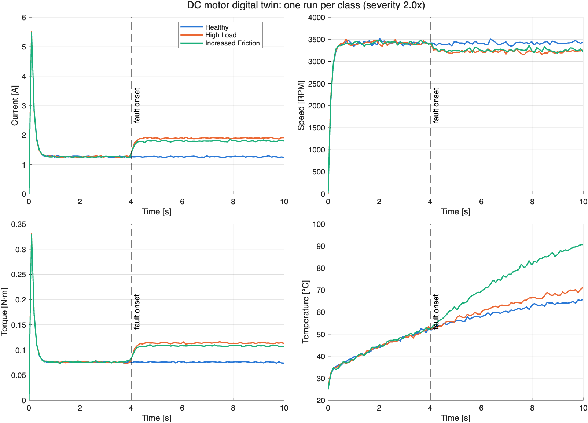
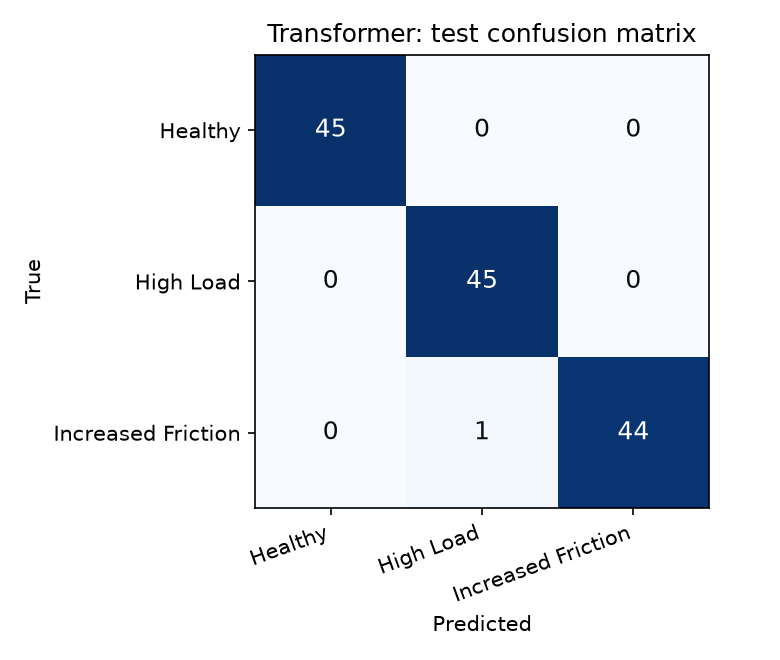
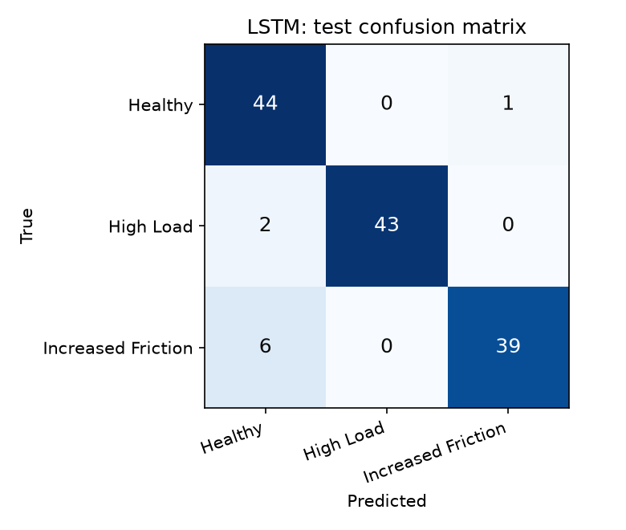
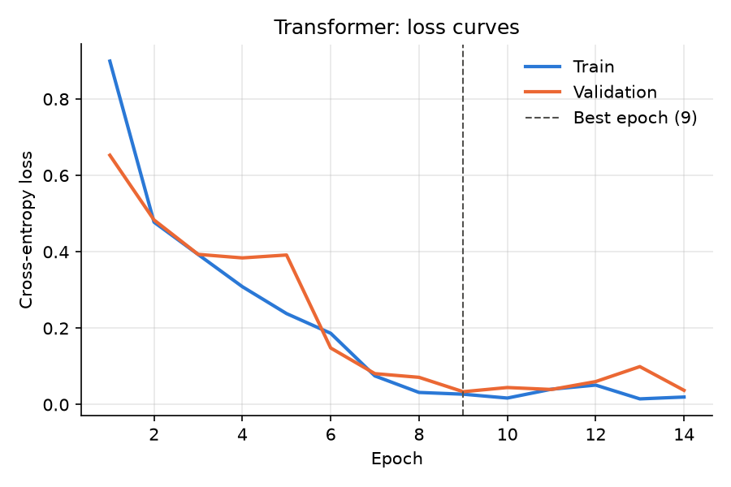
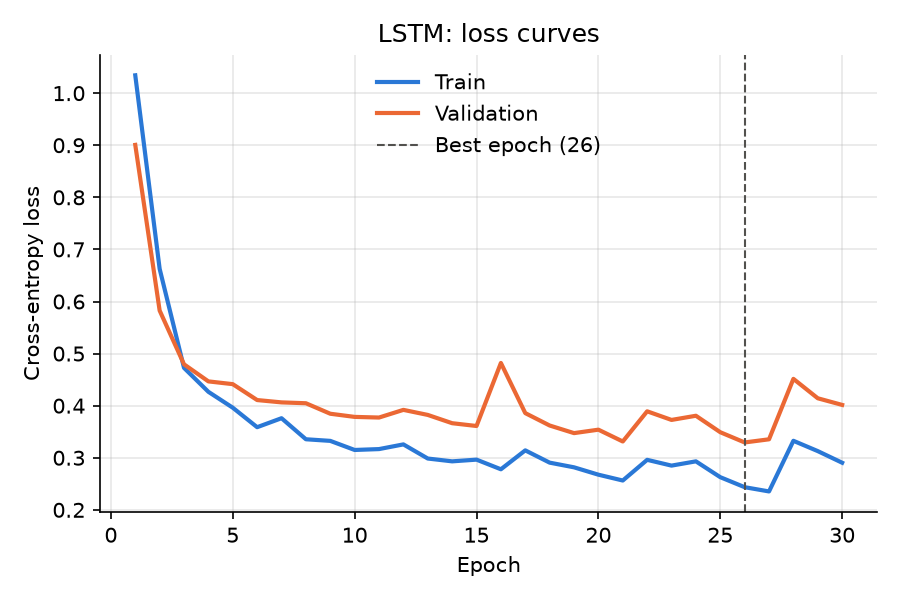
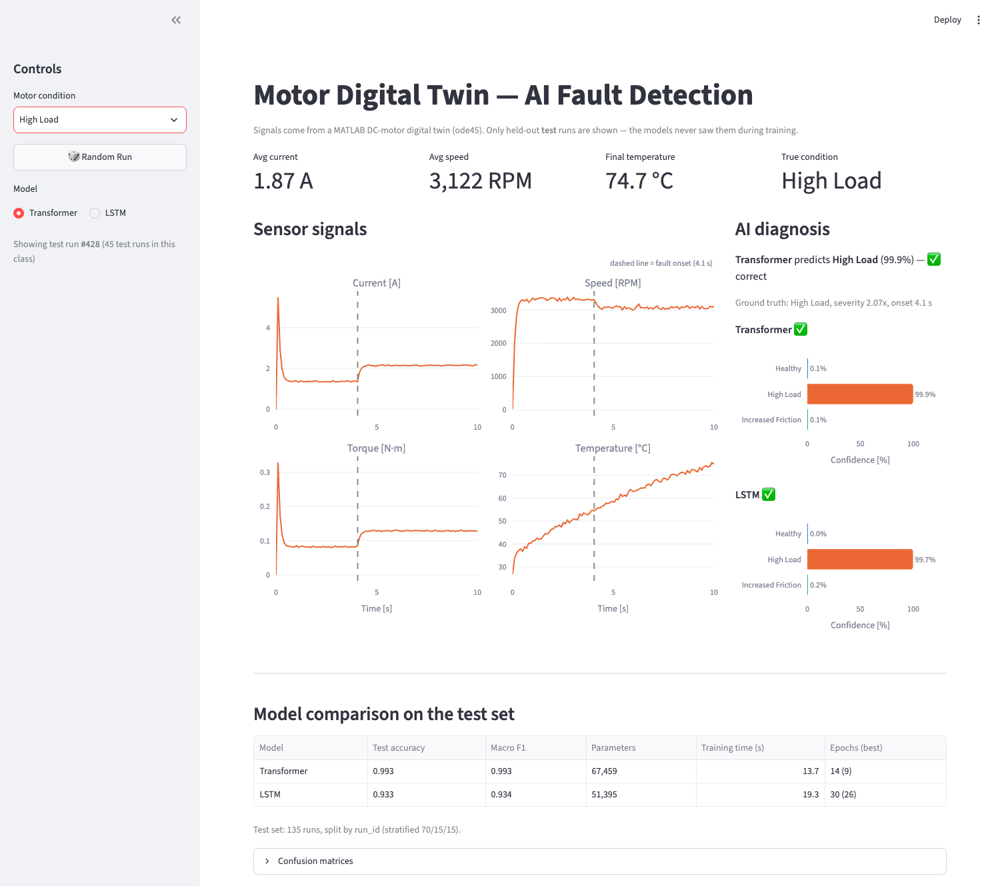

# Motor Digital Twin — AI Fault Detection

**▶ Live demo:** https://motor-digital-twin-fault-detection-9hka6gsfntwxv2xzma5jan.streamlit.app
(hosted on Streamlit Community Cloud; if it has been idle, click "Yes, get this app back up!" and wait ~30 s)

A physics-based **digital twin of a DC motor in MATLAB** generates labeled sensor data, and two
**PyTorch** sequence models (a **Transformer** and an **LSTM** baseline) learn to diagnose the motor's
condition from 10 seconds of current, speed, torque, and temperature. A **Streamlit** dashboard shows
held-out test runs with live predictions.

Three conditions are classified:

| Label | Condition | What changes in the twin |
|---|---|---|
| 0 | Healthy | nothing |
| 1 | High Load | load torque `T_L` is multiplied by a severity factor after the fault onset |
| 2 | Increased Friction | friction coefficient `B` is multiplied by a severity factor after the fault onset |



## Architecture

```
 ┌────────────────────────────┐      ┌──────────────────────┐
 │   MATLAB Digital Twin      │      │  data/               │
 │  motor_params.m            │      │  motor_dataset.csv   │
 │  dc_motor_ode.m  (physics) │ ───► │  900 runs x 100 steps│
 │  simulate_motor.m (ode45)  │      │  run_metadata.csv    │
 │  generate_dataset.m        │      └──────────┬───────────┘
 └────────────────────────────┘                 │
                                                ▼
                                 ┌──────────────────────────────┐
                                 │ train.py (PyTorch)           │
                                 │  split by run_id 70/15/15    │
                                 │  standardize (train stats)   │
                                 │   ┌─────────┐  ┌───────────┐ │
                                 │   │  LSTM   │  │Transformer│ │
                                 │   └─────────┘  └───────────┘ │
                                 └──────────────┬───────────────┘
                                                │ checkpoints/ + results/
                                                ▼
                                 ┌──────────────────────────────┐
                                 │ app.py (Streamlit dashboard) │
                                 │  signals, predictions,       │
                                 │  confidence, comparison      │
                                 └──────────────────────────────┘
```

## Project structure

```
matlab/        digital twin + dataset generation
  motor_params.m      parameters of a small 24 V DC motor (struct)
  dc_motor_ode.m      the three differential equations + fault injection
  simulate_motor.m    ode45 over 0-10 s, resampled to 100 steps, sensor noise -> table
  generate_dataset.m  900 randomized runs -> data/motor_dataset.csv
  plot_examples.m     one run per class -> results/matlab_example_signals.png
  main.m              runs generate_dataset + plot_examples
data/          CSVs written by MATLAB
models/        transformer.py, lstm.py
train.py       trains and compares both models
app.py         Streamlit dashboard
checkpoints/   trained weights, scaler, train/val/test split
results/       metrics, comparison table, plots
```

## The motor physics (plain English)

The twin has three state variables: current $`i`$, speed $`\omega`$, and winding temperature $`T`$.

```math
\begin{aligned}
L\,\frac{di}{dt} &= V - R\,i - K_e\,\omega && \text{electrical}\\
J\,\frac{d\omega}{dt} &= K_t\,i - B\,\omega - T_L && \text{mechanical}\\
C_{th}\,\frac{dT}{dt} &= i^2 R + B\,\omega^2 - \frac{T - T_{amb}}{R_{th}} && \text{thermal}
\end{aligned}
```

Every equation used in the project (steady state, time constants, noise, the neural networks, the
loss and the metrics) is listed in the [Equations reference](#equations-reference) section.

1. **Voltage → current.** The supply voltage `V` pushes current through the winding resistance `R`
   (and inductance `L`). As the motor spins it generates a **back-EMF** `Ke*w` that opposes the supply,
   so the faster it spins, the less current flows.
2. **Current → torque.** The electromagnetic torque is proportional to current: `torque = Kt*i`.
3. **Torque → speed.** The motor accelerates (inertia `J`) until its torque is balanced by
   **friction** `B*w` (grows with speed) plus the **load** `T_L` (constant).
4. **Load and friction.** Anything that asks for more torque makes the motor slow down a little. Less
   speed means less back-EMF, so more current flows, which produces the extra torque. A new steady
   state follows with **lower speed and higher current**.
5. **Heating.** Copper losses `i^2*R` and friction losses `B*w^2` heat the motor; heat leaks to the
   ambient air through thermal resistance `R_th`. The thermal constants are deliberately scaled down
   (time constant 6 s instead of minutes) so heating is visible within a 10 s simulation.

The nominal motor settles at about 3400 RPM and 1.3 A at 24 V.

### How each fault changes the signals

| Signal | High Load (`T_L` ×s) | Increased Friction (`B` ×s) |
|---|---|---|
| Current / torque | step **up** at the onset | step **up** at the onset |
| Speed | step **down** | step **down** |
| Temperature | rises a bit faster (more `i^2 R`) | rises **much** faster (more `i^2 R` **and** `B w^2`) |

Both faults look almost the same electrically. At steady state `V = R*i + Ke*w`, so for *any* extra
torque demand the current rise and speed drop are tied together the same way. The main physical
difference is **where the power goes**: extra load power leaves through the shaft, but extra friction
power is converted to **heat inside the motor**. The temperature curve is therefore the key signal for
separating the two faults (see the example figure: at 2× severity, friction ends about 20 °C hotter than
high load).

## How the dataset was made harder, and why

A dataset where every healthy motor is identical and every fault is strong is solved at 100%
by a threshold on the current, which proves nothing. To force the models to learn the *pattern*
of a fault rather than memorize absolute values, every one of the 900 runs is randomized
(`generate_dataset.m`, all knobs in one `cfg` struct):

| Knob | Range | Why it makes the task harder |
|---|---|---|
| Fault onset | 2–6 s | the model must find the change anywhere in the window |
| Fault severity | 1.3× (mild) – 3× (strong) | mild faults give small steps, close to healthy |
| Supply voltage | 20–28 V | changes speed, current, and heating of *healthy* runs |
| Nominal load | ±30% | a healthy heavily loaded motor looks like a mild High Load fault |
| Nominal friction | ±30% | a healthy stiff motor looks like a mild friction fault |
| Ambient temperature | 20–35 °C | absolute temperature alone isn't informative |
| Sensor noise | 1% Gaussian per channel | realistic measurement noise |

Because operating ranges overlap, **absolute levels overlap between classes**. The model has to
detect the *step change* at the onset and the *shape* of the temperature rise.

The plan was to make the data harder still (lower minimum severity, wider ranges) if both models
scored ~100%. That wasn't needed: the LSTM reaches 93%, so the dataset already separates the models,
and the results below come from this dataset without further tuning.

## Models

| | Transformer | LSTM |
|---|---|---|
| Input | (batch, 100 steps, 4 features) | same |
| Core | Linear 4→64, sinusoidal positional encoding, 2 encoder layers (4 heads, FF 128, dropout 0.1) | 2-layer LSTM, hidden 64, dropout 0.1 |
| Sequence summary | global average pooling over time | last hidden state of the top layer |
| Head | Linear 64→3 | Linear 64→3 |

Training: Adam (lr 1e-3), cross-entropy, batch 32, up to 30 epochs, early stopping on validation loss
(patience 5, best weights restored), fixed seeds. Runs on a laptop CPU in well under a minute per model.

## Results

Test set: 135 runs (45 per class), never used for training or model selection. MacBook (Apple M2) CPU.
Accuracy and F1 are fully reproducible (fixed seeds); training time is wall-clock and varies a few seconds between runs.

| Model | Test accuracy | Macro F1 | Parameters | Training time (s) | Epochs (best) |
|---|---|---|---|---|---|
| Transformer | 0.993 | 0.993 | 67,459 | 8.5 | 14 (9) |
| LSTM | 0.933 | 0.934 | 51,395 | 14.4 | 30 (26) |

| Transformer | LSTM |
|---|---|
|  |  |
|  |  |

**What the errors say**
- The Transformer makes **one** mistake: a *mild* (1.38×) friction fault predicted as High Load.
  That is exactly the case where the two faults are physically closest.
- The LSTM makes 9 mistakes; **7 are Increased Friction runs predicted as Healthy**, mostly with
  early onsets (≤ 4.2 s). To spot the fault, a model has to compare signal levels before and after
  the onset. Attention compares any two time steps directly, while the LSTM must carry the
  pre-fault level through its memory.
- The LSTM was still improving when it hit the 30-epoch cap (best epoch 26), so with more epochs the
  gap would likely shrink. The comparison is at an equal, small training budget.
- 135 test runs is a small test set: one run is 0.7 percentage points. Treat the numbers as indicative.

## Dashboard



Choose a condition and a model in the sidebar, and press **Random Run** to load another held-out
test run. The dashboard shows metric cards, the four signals (with the fault onset marked), the true
label, both models' predictions with confidence bars, and the comparison table.

## How to run

Tested on macOS (Apple Silicon) with MATLAB R2025a and Python 3.14.

```bash
# 0) Python environment
python3 -m venv .venv
source .venv/bin/activate
pip install -r requirements.txt

# 1) Digital twin + dataset (about 1 min; or open matlab/main.m in MATLAB and press Run)
/Applications/MATLAB_R2025a.app/bin/matlab -batch "cd matlab; main"

# 2) Train and compare both models (about 1 min on CPU)
python train.py

# 3) Dashboard locally (http://localhost:8501) — or use the live demo link above
streamlit run app.py
```

The generated CSV, trained checkpoints, and results are included, so you can run step 3
directly without MATLAB.

## Limitations

- **Simulated data only.** The twin is an idealized linear DC motor model. There's no real hardware,
  no bearing wear, no brush arcing, no temperature-dependent resistance, and no sensor drift.
- **Scaled thermal constants.** Heating is sped up so it's visible in 10 s. Real motors heat over minutes.
- **Only three clean classes**, one fault at a time, each a step change. Real faults can develop
  gradually and combine.
- **Small test set** (135 runs) and a single seed, so there are no confidence intervals.
- A model trained on this twin **will not transfer to a real motor** without real data (sim-to-real gap).

## Equations reference

Everything the project computes, in pipeline order: MATLAB digital twin → dataset → neural networks →
training → metrics. Numbers use the nominal motor from `matlab/motor_params.m`.

### 1. Symbols and nominal values

| Symbol | Meaning | Nominal value |
|---|---|---|
| $`V`$ | supply voltage | 24 V (randomized 20–28 V) |
| $`R`$ | armature resistance | 2 Ω |
| $`L`$ | armature inductance | 5 mH |
| $`K_e`$ | back-EMF constant | 0.06 V·s/rad |
| $`K_t`$ | torque constant | 0.06 N·m/A |
| $`J`$ | rotor + load inertia | 2×10⁻⁴ kg·m² |
| $`B`$ | viscous friction coefficient | 1×10⁻⁴ N·m·s/rad |
| $`T_L`$ | load torque | 0.04 N·m |
| $`C_{th}`$ | thermal capacitance (scaled) | 2 J/K |
| $`R_{th}`$ | thermal resistance to ambient | 3 K/W |
| $`T_{amb}`$ | ambient temperature | 25 °C (randomized 20–35 °C) |

### 2. Digital twin: state-space model (`dc_motor_ode.m`)

State vector and initial condition (motor at rest, at ambient temperature):

```math
\mathbf{x}(t) = \begin{bmatrix} i(t) \\ \omega(t) \\ T(t) \end{bmatrix},
\qquad
\mathbf{x}(0) = \begin{bmatrix} 0 \\ 0 \\ T_{amb} \end{bmatrix}
```

```math
\begin{aligned}
L\,\frac{di}{dt} &= V - R\,i - K_e\,\omega
  && \text{electrical (Kirchhoff's voltage law)}\\[4pt]
J\,\frac{d\omega}{dt} &= K_t\,i - B(t)\,\omega - T_L(t)
  && \text{mechanical (Newton's 2nd law for rotation)}\\[4pt]
C_{th}\,\frac{dT}{dt} &= \underbrace{i^2 R}_{\text{copper loss}}
  + \underbrace{B(t)\,\omega^2}_{\text{friction loss}}
  - \frac{T - T_{amb}}{R_{th}}
  && \text{thermal (energy balance)}
\end{aligned}
```

**Fault model.** With fault onset $`t_f`$ and severity $`s`$ (Healthy: $`s = 1`$):

```math
T_L(t) = \begin{cases} T_{L,0} & t < t_f \\ s\,T_{L,0} & t \ge t_f \end{cases}
\ \ \text{(High Load)}
\qquad\qquad
B(t) = \begin{cases} B_0 & t < t_f \\ s\,B_0 & t \ge t_f \end{cases}
\ \ \text{(Increased Friction)}
```

**Measured outputs** (`simulate_motor.m`):

```math
\tau_{em} = K_t\, i,
\qquad
n_{rpm} = \frac{60}{2\pi}\,\omega
```

### 3. Steady state: why the two faults look alike electrically

Setting all derivatives to zero:

```math
\omega_{ss} = \frac{\dfrac{K_t V}{R} - T_L}{\dfrac{K_t K_e}{R} + B},
\qquad
i_{ss} = \frac{T_L + B\,\omega_{ss}}{K_t},
\qquad
T_{ss} = T_{amb} + R_{th}\left(i_{ss}^2 R + B\,\omega_{ss}^2\right)
```

The electrical equation at steady state, $`V = R\,i_{ss} + K_e\,\omega_{ss}`$, ties the current rise to the
speed drop in **the same way for every fault**:

```math
\Delta\omega_{ss} = -\frac{R}{K_e}\,\Delta i_{ss}
```

The faults only differ in how the extra torque demand arises, and in where the extra power ends up:

```math
\begin{aligned}
\Delta T_{\text{load}} &= (s-1)\,T_{L,0} && \text{power leaves through the shaft}\\
\Delta T_{\text{friction}} &= (s-1)\,B_0\,\omega && \text{power becomes heat inside the motor}
\end{aligned}
```

Worked example with the nominal motor at severity $`s = 2`$. The values come from the formulas above
and match the MATLAB simulation:

| Condition | Speed (RPM) | Current (A) | Copper loss $`i^2R`$ (W) | Friction loss $`B\omega^2`$ (W) | Total heat (W) | $`T_{ss}`$ (°C) |
|---|---|---|---|---|---|---|
| Healthy | 3418 | 1.26 | 3.19 | 12.81 | 16.0 | 73.0 |
| High Load 2× | 3217 | 1.90 | 7.18 | 11.35 | 18.5 | 80.6 |
| Increased Friction 2× | 3247 | 1.80 | 6.48 | 23.12 | 29.6 | 113.8 |

Speed and current shift by almost the same amount for both faults, but friction adds about 11 W more
heat. **Temperature is the signal that separates them.**

### 4. Time constants

```math
\tau_{el} = \frac{L}{R} = 2.5\ \text{ms},
\qquad
\tau_{mech} = \frac{J}{B + K_t K_e / R} \approx 105\ \text{ms},
\qquad
\tau_{th} = R_{th}\,C_{th} = 6\ \text{s}
```

For a constant heat input $`P`$, the thermal equation has the first-order solution

```math
T(t) = T_{amb} + R_{th}\,P\left(1 - e^{-t/\tau_{th}}\right)
```

so with $`\tau_{th} = 6`$ s the temperature reaches about 81% of its final rise
($`1 - e^{-10/6}`$) within the 10 s window. A real motor ($`\tau_{th}`$ of minutes) would barely move.
The ratio $`\tau_{th}/\tau_{el} = 2400`$ makes the system only mildly stiff, so ode45 is fine.

### 5. Numerical integration (ode45, Dormand–Prince 4(5))

Each step combines 7 slope evaluations of $`\mathbf{f}(t, \mathbf{x})`$ (the right-hand side above):

```math
\mathbf{k}_j = \mathbf{f}\Big(t_n + c_j h,\ \mathbf{x}_n + h\sum_{l<j} a_{jl}\,\mathbf{k}_l\Big),
\qquad
\mathbf{x}_{n+1} = \mathbf{x}_n + h\sum_{j=1}^{7} b_j\,\mathbf{k}_j
```

A 4th- and a 5th-order estimate are compared. The step is accepted when, for every state component,

```math
|e_{n+1}| \le \max\big(\text{RelTol}\cdot|x_{n+1}|,\ \text{AbsTol}\big),
\qquad \text{RelTol} = 10^{-5},\ \ \text{AbsTol} = 10^{-7},\ \ h \le 0.01\ \text{s}
```

### 6. Resampling and sensor noise

ode45 returns an irregular time grid, which is linearly interpolated (`interp1`) onto 100 uniform samples:

```math
t_k = \frac{10\,k}{99}\ \text{s},\ \ k = 0,\dots,99,
\qquad
x(t_k) = x(t_n) + \frac{t_k - t_n}{t_{n+1} - t_n}\big(x(t_{n+1}) - x(t_n)\big),
\quad t_n \le t_k \le t_{n+1}
```

Then each signal $`y`$ (current, speed, torque, temperature) gets Gaussian noise scaled to its own size:

```math
\tilde y_k = y_k + \sigma_y\,\varepsilon_k,
\qquad
\sigma_y = \eta \cdot \frac{1}{100}\sum_{k}|y_k|,
\qquad
\varepsilon_k \sim \mathcal{N}(0, 1),
\quad \eta = 0.01
```

### 7. Dataset randomization (`generate_dataset.m`)

For each of the 900 runs:

```math
V \sim \mathcal{U}(20, 28),
\quad
T_{L,0} \sim 0.04\cdot\mathcal{U}(0.7, 1.3),
\quad
B_0 \sim 10^{-4}\cdot\mathcal{U}(0.7, 1.3),
\quad
T_{amb} \sim \mathcal{U}(20, 35)
```

```math
t_f \sim \mathcal{U}(2, 6)\ \text{s},
\qquad
s \sim \mathcal{U}(1.3, 3)\ \text{(faults)},
\quad s = 1\ \text{(healthy)}
```

Result: $`X \in \mathbb{R}^{900 \times 100 \times 4}`$ and $`y \in \{0, 1, 2\}^{900}`$, split by run into 630 / 135 / 135.

### 8. Standardization (training statistics only)

For each feature $`f`$, over all $`N_{tr} = 630`$ training runs and 100 time steps:

```math
\mu_f = \frac{1}{100\,N_{tr}}\sum_{n \in \text{train}}\sum_{k} x_{n,k,f},
\qquad
\sigma_f = \sqrt{\frac{1}{100\,N_{tr}}\sum_{n \in \text{train}}\sum_{k}\left(x_{n,k,f} - \mu_f\right)^2},
\qquad
\hat x_{n,k,f} = \frac{x_{n,k,f} - \mu_f}{\sigma_f}
```

The same $`\mu_f, \sigma_f`$ (saved in `checkpoints/scaler.json`) are applied to validation, test and the dashboard.

### 9. Transformer (`models/transformer.py`)

**Embedding + sinusoidal positional encoding** ($`d = 64`$, position $`k = 0,\dots,99`$):

```math
h_k^{(0)} = W_e\,\hat x_k + b_e + PE_k,
\qquad W_e \in \mathbb{R}^{64 \times 4}
```

```math
PE_{k,\,2j} = \sin\!\left(\frac{k}{10000^{2j/d}}\right),
\qquad
PE_{k,\,2j+1} = \cos\!\left(\frac{k}{10000^{2j/d}}\right)
```

**Multi-head self-attention** (4 heads, $`d_k = d/4 = 16`$), where $`H \in \mathbb{R}^{100 \times 64}`$ stacks all time steps:

```math
Q_h = H W_h^Q,\quad K_h = H W_h^K,\quad V_h = H W_h^V,
\qquad
\text{head}_h = \operatorname{softmax}\!\left(\frac{Q_h K_h^{\top}}{\sqrt{d_k}}\right) V_h
```

```math
\operatorname{MHA}(H) = \big[\text{head}_1 \,\|\, \text{head}_2 \,\|\, \text{head}_3 \,\|\, \text{head}_4\big]\, W^O
```

**Encoder layer** (PyTorch default post-norm, ReLU feed-forward 64 → 128 → 64), applied twice:

```math
Z = \operatorname{LayerNorm}\big(H + \operatorname{Dropout}(\operatorname{MHA}(H))\big),
\qquad
H' = \operatorname{LayerNorm}\big(Z + \operatorname{Dropout}(\operatorname{FFN}(Z))\big)
```

```math
\operatorname{FFN}(z) = W_2\,\operatorname{ReLU}(W_1 z + b_1) + b_2,
\qquad
\operatorname{LayerNorm}(z) = \gamma \odot \frac{z - \operatorname{mean}(z)}{\sqrt{\operatorname{var}(z) + \epsilon}} + \beta
```

**Global average pooling + classifier:**

```math
\bar h = \frac{1}{100}\sum_{k=0}^{99} h_k^{(2)},
\qquad
\mathbf{z} = W_c\,\bar h + b_c \in \mathbb{R}^{3}
```

### 10. LSTM (`models/lstm.py`)

For each time step $`k = 1,\dots,100`$ (in these equations $`i_k`$ is the input gate, not the motor current):

```math
\begin{aligned}
f_k &= \sigma\left(W_f\,x_k + U_f\,h_{k-1} + b_f\right) && \text{forget gate}\\
i_k &= \sigma\left(W_i\,x_k + U_i\,h_{k-1} + b_i\right) && \text{input gate}\\
g_k &= \tanh\left(W_g\,x_k + U_g\,h_{k-1} + b_g\right) && \text{candidate memory}\\
o_k &= \sigma\left(W_o\,x_k + U_o\,h_{k-1} + b_o\right) && \text{output gate}\\
c_k &= f_k \odot c_{k-1} + i_k \odot g_k && \text{cell state}\\
h_k &= o_k \odot \tanh(c_k) && \text{hidden state}
\end{aligned}
```

Layer 2 takes layer 1's hidden states as input (dropout 0.1 in between). The classifier uses the top
layer's last hidden state:

```math
\mathbf{z} = W_c\,h_{100}^{(2)} + b_c \in \mathbb{R}^{3}
```

### 11. Parameter counts

With hidden size $`H = 64`$, an LSTM layer has $`4\big(H(d_{in} + H) + 2H\big)`$ parameters (4 gates, with
PyTorch's two bias vectors per gate).

| Transformer part | Parameters | LSTM part | Parameters |
|---|---|---|---|
| Embedding $`4\cdot64 + 64`$ | 320 | Layer 1 $`4(64\cdot68 + 128)`$ | 17,920 |
| Encoder layer 1 (attention 16,640 + FFN 16,576 + LayerNorms 256) | 33,472 | Layer 2 $`4(64\cdot128 + 128)`$ | 33,280 |
| Encoder layer 2 | 33,472 | Classifier $`64\cdot3 + 3`$ | 195 |
| Classifier $`64\cdot3 + 3`$ | 195 | | |
| **Total** | **67,459** | **Total** | **51,395** |

### 12. Prediction, loss and optimizer

**Softmax.** The probabilities are the confidence bars in the dashboard:

```math
p_c = \frac{e^{z_c}}{\sum_{j=0}^{2} e^{z_j}},
\qquad
\hat y = \arg\max_c\, p_c
```

**Cross-entropy loss** over a batch of $`M = 32`$ runs:

```math
\mathcal{L} = -\frac{1}{M}\sum_{n=1}^{M} \log p_{n,\,y_n}
```

**Adam** ($`\alpha = 10^{-3}`$, $`\beta_1 = 0.9`$, $`\beta_2 = 0.999`$, $`\epsilon = 10^{-8}`$), with gradient $`g_t = \nabla_\theta \mathcal{L}`$:

```math
\begin{aligned}
m_t &= \beta_1 m_{t-1} + (1 - \beta_1)\,g_t, &
v_t &= \beta_2 v_{t-1} + (1 - \beta_2)\,g_t^2,\\
\hat m_t &= \frac{m_t}{1 - \beta_1^t}, &
\hat v_t &= \frac{v_t}{1 - \beta_2^t},\\
\theta_t &= \theta_{t-1} - \alpha\,\frac{\hat m_t}{\sqrt{\hat v_t} + \epsilon}
\end{aligned}
```

**Dropout** ($`p = 0.1`$, training only). Each activation is kept with probability $`1 - p`$ and rescaled:

```math
\tilde a = \frac{m \odot a}{1 - p},
\qquad m \sim \text{Bernoulli}(1 - p)
```

**Early stopping** (patience 5, at most 30 epochs). The weights from the best validation epoch are kept:

```math
e^{*} = \arg\min_{e}\ \mathcal{L}_{val}(e),
\qquad
\text{stop when } e - e^{*} \ge 5
```

### 13. Evaluation metrics

For $`N = 135`$ test runs and classes $`c \in \{0, 1, 2\}`$:

```math
\text{Accuracy} = \frac{1}{N}\sum_{n=1}^{N} \mathbf{1}\left[\hat y_n = y_n\right]
```

```math
P_c = \frac{TP_c}{TP_c + FP_c},
\qquad
R_c = \frac{TP_c}{TP_c + FN_c},
\qquad
F1_c = \frac{2\,P_c\,R_c}{P_c + R_c},
\qquad
\text{Macro F1} = \frac{1}{3}\sum_{c=0}^{2} F1_c
```

Confusion matrix: $`C_{jk}`$ is the number of test runs of true class $`j`$ predicted as class $`k`$.
